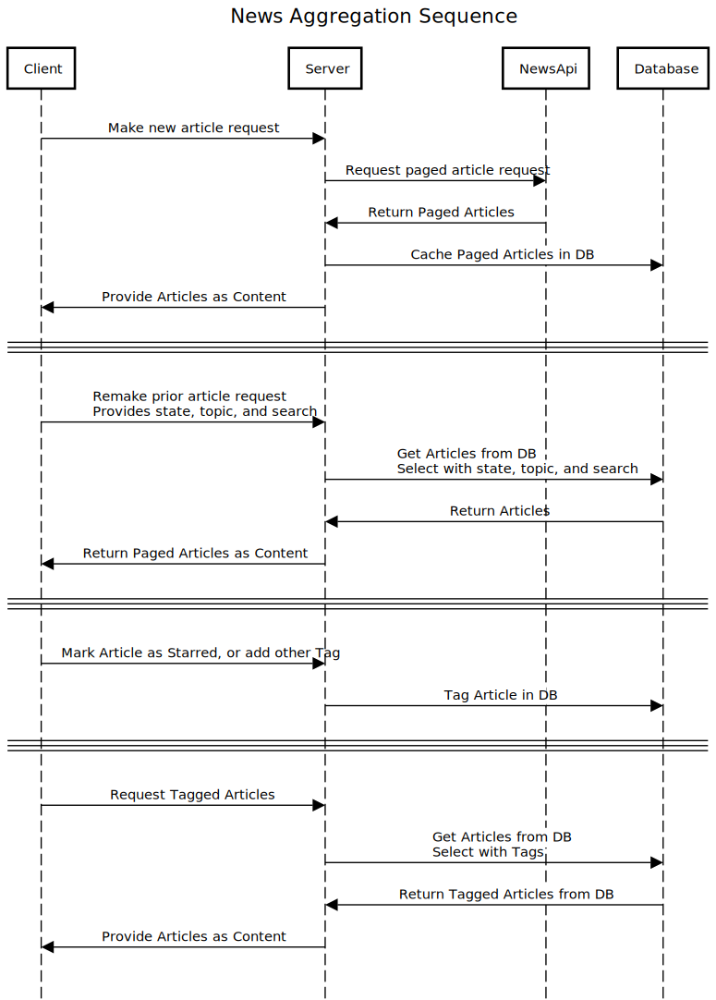

#  Typescript React Client & Express Server
## State Affairs: Take-Home Assignment: Legislative News Aggregator
## Getting Started

To get started with this project, follow these steps:

#### Clone this repository to your local machine.

```bash
git clone https://github.com/coderodent-calfee/LegislativeNewsAggregator.git
```

#### Put your NewsAPI key into the API_KEY in this file:
```bash
 edit application/common/newsInterface.ts
```

#### Install the project dependencies by running the following command in the project directory:

```bash
npm install
```
then
```bash
npm run init
```

#### Start the client and server with the following command

```bash
npm run launch
```
The client server is at http://localhost:3000/ the backend server is at http://localhost:3035/, but the presentation is just a static page

#### Other Commands:
```bash
npm run [client|server|both] [build|start|lint]
```
## System Design Considerations:
- **News Aggregation**: The News router in news.ts is an example of how additional news providers would be added to the 
 routing. The NewsService is used to define the interface to any number of custom accessors to providers.
 The aggregation happens when the articles are retrieved, and the format is consolidated into a common format. The link 
 is hashed into an ID, which should provide a simple way to remove duplicates.
- **Scalability**: Discuss how the system could handle thousands of news articles
across multiple states and topics. Would you index the articles? What storage
strategies would you use?
- **Search Optimization**: Searching through potentially large datasets could be made more efficient by time slicing the 
 queries, or otherwise spreading the searches around, date-limiting or limiting the page count.

## Todo:
- **Filter & Search**: Implement a filtering UI where users can filter articles by
state, topic, and perform keyword searches. This would mean making the search tags live, and allowing the UI to modify 
 and add tags to articles. The code is there; it just needs to be wired up. 
- **Responsive Design**: Mobile is not supported, as it's currently only a localhost project.
- **Present cached results** The code is there; it just needs to be wired up.
- **Additionally:**
  - I would add Starred ⭐ articles and a means to preserve at least the links for articles of interest.
  - The mechanism for creating and removing search tags in not quite right, and that needs addressing.
  - Eventually it should be easy to add a method to use search terms to recall articles from the database.


